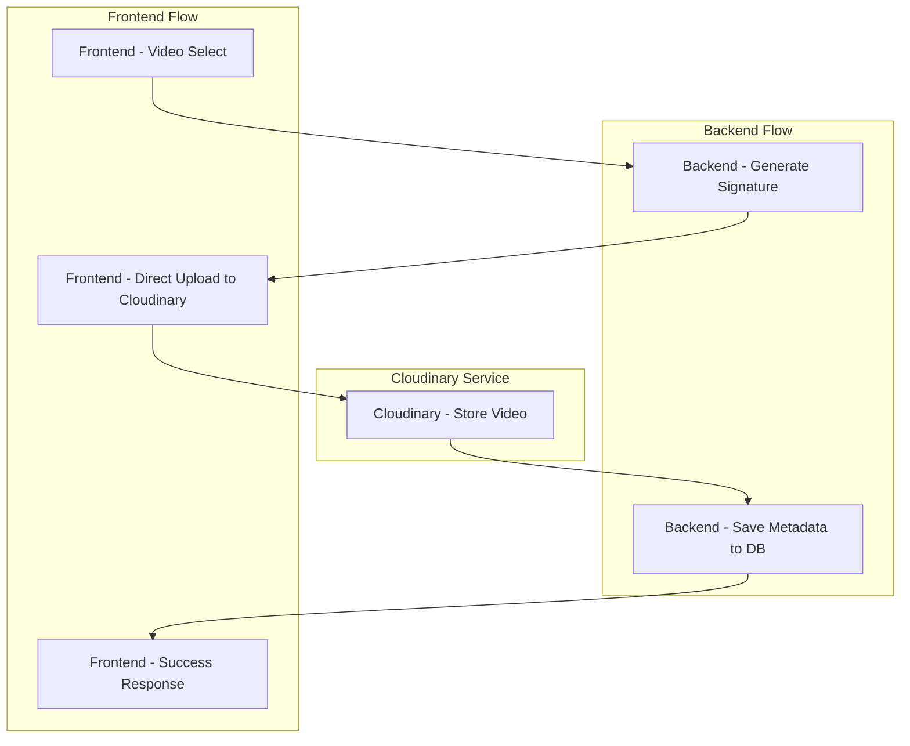

# MERN Major Project - Leetcode like coding platform
-A full-stack MERN application where users can register, solve coding problems, and admins can manage problems & users.
A lot of features and functionalities to be added in future.
 
# Tech Stack
-Frontend: React.js (to be added later)

-Backend: Node.js, Express.js

-Database: MongoDB, Redis

-Authentication: JWT, bcrypt

-Validation: validator library

-More to be added in future

# Daily Progress Log:

## DAY01 
- Defined User schema with fields: firstName, lastName, age, email, password, role, problemSolved  
 
## DAY02 
- Implemented registration and login flows  
- Added input validation and sanitization before database calls  
- Secured passwords with bcrypt.  
- Issued JWT tokens on successful authentication 

## DAY03 
- Added `/getProfile` so users can retrieve their own profile information  
- Implemented logout by blacklisting JWTs in Redis  
- Created middleware to reject any blacklisted token on protected routes  
- Introduced an admin-only `/admin/register` endpoint for onboarding new admins  
- Wrote `adminMiddleware` to ensure only existing admins can hit that route  
- Seeded the very first admin directly in the database to kick things off  
- Included the user’s role inside the JWT payload for easy permission checks  
- Defined the Problem model with fields for tags, title, description, examples, test cases, and creator ID.

## DAY04
- Reviewed and validated reference solution code before inserting problems into the database
- Integrated Judge0 API for automated code execution and evaluation:
- Chose Axios over Fetch API for its built-in interceptors, automatic JSON parsing, and enhanced error handling.
- Implemented a two-step submission workflow:

     - POST user code and test cases to Judge0; receive submission tokens for each test case
     - Poll GET endpoint with tokens to retrieve execution results

- Interpreted Judge0 status codes:
- Status ID = 3 → Accepted
- Status ID < 3 → Pending
- Status ID > 3 → Rejected or Error
- Developed POST /problems/:id/submit endpoint to handle batch submissions against all associated test cases.
- Added robust error handling and retry logic to handle network timeouts or API failures.

## DAY05
- Implemented admin-only functionality for updating and deleting problems, secured via admin middleware .
- Added routes for users to view individual problems and browse the full problem list.
- Ensured clear separation between admin and user access, maintaining security and scalability.
- Continued refining backend structure for modularity and clarity

## DAY06
- created submission schema when user submits its code
- Implemented submission workflow:
- Fetched problem details and hidden test cases from DB.
- Stored initial submission with pending status.
- Sent code to Judge0 with hidden test cases, fetched results via tokens.
- Processed response (test cases passed, runtime, memory, errors).
- Updated submission in DB with final result and improved error handling.

## DAY07
- Added problemSolved field in the user schema.
- Updated the user submission function for better handling.
- Used populate and optimized database calls.
- Built an API to run code on visible test cases before final submission.
- Added delete user functionality.
- Created an API to fetch all submissions of a specific problem by a user.
- Added a compound index (userId + problemId) in the submission schema for faster lookups and faster search.

## DAY08
- Implemented Sliding Window Rate Limiting using Redis Sorted Sets
- prevent API abuse, DDoS attack , brute-force attacks, and ensure fair resource usage
- Algorithm Used: Custom sliding window implementation for accurate request tracking
- use UserID for authenticated users, fall back to IP + User-Agent for anonymous users to handle shared networks
- Protected Routes:
    - Authentication: 5 login attempts per 15 minutes, 3 registrations per hour
    - Admin Operations: 1 admin registration per day, 10 problem creations per hour
    - Submissions: 10 code submissions per minute, 15 code runs per minute
    - User Operations: 20-30 read requests per minute depending on endpoint
    
- Redis ZADD, ZREMRANGEBYSCORE, ZCARD, EXPIRE
- remove old requests, count current window, add new entry, set key expiration

## DAY09
**Authentication Updates**
- Enhanced Security Features Implemented:
   - JSON Responses: Login/register endpoints now return user data + tokens instead of plain text messages
   - Secure Cookies: Added httpOnly ,Secure and sameSite flags for better security
- New Endpoint Added:  "/check" :	Validates user token and returns user data if authenticated 
  - Enables frontend to immediately check user authentication status on app load
  - Eliminates need for additional API calls to get user data
  - Provides seamless user experience (dont redirects to login if already authenticated)
  - Installed and configured **CORS middleware** to enable communication between frontend (React @ localhost:5173) and backend.

  ## DAY10
- Added AI doubt solver API using Google Gemini
- New End point created for ai doubt solve
- Features of my ai model by adding prompt:
   - Context-Aware: Strictly problem-specific responses
   - Multi-Format: JSON responses with code, explanation, examples
   - Beautifully formatted code with dark them
   - Multiple assistance modes (hints, code review, solutions)
   - Code Ready: Copy-paste friendly formatted code
   - Prevents off-topic queries - focuses only on current DSA problem

## DAY11
- Created a new solutionVideo schema to add editorial videos for coding 
problems
- Schema fields include:
  - problemId → References the related problem
  - userId → References the uploader (admin or user)
  - cloudinaryPublicId → Unique identifier for Cloudinary asset
  - secureUrl → Direct secure link to the uploaded video
  - thumbnailUrl (optional) → Preview image for the video
  - duration → Stores video length in seconds
- Enabled automatic timestamps for upload tracking  
- Prepared groundwork for Cloudinary integration:
  - Videos will be uploaded directly from the frontend
  - Backend will provide token & digital signature for secure upload

## DAY12: 

- Architecture Decisions
  - Cloudinary for Video Storage → Chosen for scalability, built-in CDN, and automatic processing features
  - Direct Frontend Uploads → Reduces backend server load and improves upload speed
  - Signed Upload Requests → Ensures secure uploads without exposing API secrets
  - Metadata in MongoDB → Centralized and structured storage for problem-linked videos
### 🎥 Video Upload Flow

### Implementation
- Implemented complete editorial video upload flow with Cloudinary
- Videos are uploaded directly from frontend with backend-generated secure signatures
- Backend responsibilities:
  - Generate signed token (public_id + timestamp + signature)
  - Validate and save video metadata (problemId, userId, duration,   thumbnail, secureUrl)
  - Checks added to avoid redundant video uploads
  - Support video deletion (DB + Cloudinary)

- Cloudinary integration features:
  - signed upload requests with expiration for secure upload (prevents unauthorized uploads)
  - Auto-generated thumbnails from video(dynamic)
  - Duration tracking for better UX  '

- Optimized storage  & Reduced video load time by 70% using CDN

# Upcoming Work
- AI-powered chatbot integration  
- Video integration for problem explanations  
- Build frontend using React.js  
- Enhance Admin Dashboard with more controls  
- Create Editor section   